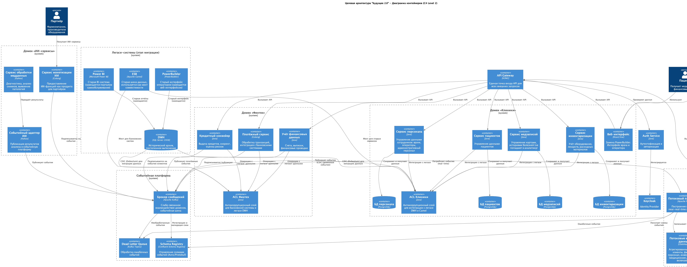

# Задание 3. Проектирование целевой архитектуры и оценка рисков внедрения

## Спроектируйте целевую архитектуру системы «Будущего 2.0» в горизонте трёх лет, используя C4-модель на уровне контейнеров и компонентов. Покажите, как изменятся ключевые системы компании при масштабировании, включая появление новых бизнес-направлений, интеграцию дополнительных источников данных и отказ от легаси-систем.

## Составьте карту рисков трансформации, определив архитектурные, организационные и технологические риски. Для каждого риска укажите вероятность его возникновения (низкая, средняя, высокая) и потенциальное влияние на бизнес (низкое, среднее, высокое).

### Архитектурные риски
| NN | Риск | Описание | Вероятность | Влияние |
|----|------|----------|-------------|---------|
|АР1| Нарушение целостности данных при миграции| При переходе от монолитного DWH к событийной архитектуре возможна потеря или дублирование данных, рассинхронизация между доменами, особенно для критических финансовых и медицинских данных | Средняя| Высокое | 
| АР2 | Сложность обеспечения консистентности в слабосвязанной архитектуре | Переход от синхронных интеграций к асинхронным событиям увеличивает риск конечной согласованности данных, что критично для финансовых операций и кредитных решений | Высокая | Высокое
| АР3 | Проблемы с обратной совместимостью схем событий | Изменение схем в Schema Registry без учёта всех потребителей может привести к падению сервисов и потере данных | Средняя | Среднее

### Организационные риски
| NN | Риск | Описание | Вероятность |Влияние|
|----|------|----------|-------------|-------|
| ОР1 | Сопротивление изменениям в командах | Разработчики и аналитики, привыкшие к SQL Server и Power BI, могут сопротивляться переходу на новую событийную архитектуру и инструменты (Flink, Kafka, ClickHouse) | Высокая | Среднее
| ОР2 | Потеря экспертизы при уходе ключевых сотрудников | Баз-фактор: знание в легаси-системах у ограниченного числа специалистов создаёт риск при их уходе | Средняя | Высокое|
| ОР3 | Сложность координации 4-х подразделений | Клиники, финтех, ИИ-сервисы и головной офис имеют разные приоритеты, что может замедлить принятие решений | Высокая | Среднее

### Технологические риски
| NN | Риск | Описание | Вероятность |Влияние|
|----|------|----------|-------------|--------|
| ТР1 | Несовместимость легаси-систем с новыми протоколами | SQL Server 2008 и PowerBuilder могут иметь ограничения при интеграции с современными инструментами (CDC, Kafka Connect) | Средняя | Среднее
| ТР2 | Проблемы с производительностью CDC на SQL Server 2008| Change Data Capture на устаревшей версии SQL Server может создавать избыточную нагрузку на продуктивную систему | Высокая | Высокое
| ТР3| Риски безопасности при работе с чувствительными данными | Медицинские и финансовые данные требуют особой защиты, новая архитектура может создавать новые векторы атак | Низкая | Высокое
|ТР4| Техническая сложность миграции бизнес-логики | Бизнес-логика из SQL Server (хранимые процедуры, функции) требует reverse-engineering и переписывания для новых сервисов | Высокая | Среднее

## Предложите план управления рисками, описав конкретные меры по их снижению. Укажите, какие риски можно минимизировать с помощью технических решений, а какие — управленческими подходами.

### Архитектурные риски
**АР1. Нарушение целостности данных при миграции**

#### Меры:

- Внедрить поэтапную миграцию с валидацией данных на каждом этапе (сравнение контрольных сумм, проверка количества записей).
- Использовать инструменты CDC (Change Data Capture) с возможностью отката изменений.
- Разработать систему мониторинга и алертинга для выявления расхождений в данных в реальном времени.
- Создать резервные копии данных перед каждым этапом миграции.
**Тип мер:** технические.

**АР2. Сложность обеспечения консистентности в слабосвязанной архитектуре**

#### Меры:
- Применить паттерн Saga для управления распределёнными транзакциями.
- Реализовать механизмы компенсации (compensating transactions) для критических операций.
- Ввести сквозной идентификатор транзакции для отслеживания операций во всех доменах.
- Настроить мониторинг задержки обработки событий и метрик согласованности данных.
  
**Тип мер:** технические.

**АР3. Проблемы с обратной совместимостью схем событий**

#### Меры:
- Внедрить строгую политику версионирования схем в Schema Registry (поддержка backward и forward compatibility).
- Автоматизировать тестирование совместимости схем с помощью CI/CD‑пайплайнов.
- Перед внедрением изменений проводить аудит всех потребителей схемы.
- Разработать план отката для случаев несовместимости.
  
**Тип мер:** технические и управленческие (политика версионирования).

### Организационные риски
**ОР1. Сопротивление изменениям в командах**
#### Меры:
- Организовать обучающие семинары и воркшопы по новым технологиям (Flink, Kafka, ClickHouse).
- Назначить «чемпионов изменений» в каждой команде — сотрудников, которые помогут коллегам адаптироваться.
- Построить систему мотивации за освоение новых инструментов.
- Провести пилотный проект с участием заинтересованных команд для демонстрации преимуществ новой архитектуры.
  
**Тип мер:** управленческие.

**ОР2. Потеря экспертизы при уходе ключевых сотрудников**
#### Меры:
- Документировать знания о легаси‑системах (схемы баз данных, бизнес‑логика, интеграции).
- Запустить программу наставничества: передача знаний от опытных сотрудников к новичкам.
- Распределить ключевые задачи между несколькими сотрудниками, чтобы избежать зависимости от одного человека.
- Регулярно обновлять документацию при изменениях в системах.
  
**Тип мер:** управленческие.

**ОР3. Сложность координации 4‑х подразделений**
#### Меры:
- Создать кросс‑функциональную рабочую группу с представителями всех подразделений.
- Внедрить единый инструмент управления проектами (Jira, Asana) для прозрачности задач и приоритетов.
- Установить регулярные встречи рабочей группы для согласования решений.
- Разработать и утвердить общую стратегию миграции, учитывающую интересы всех сторон.
  
**Тип мер:** управленческие.

### Технологические риски
**ТР1. Несовместимость легаси‑систем с новыми протоколами**
#### Меры:
- Провести аудит совместимости легаси‑систем с целевыми инструментами.
- Разработать адаптеры/коннекторы для интеграции (например, Kafka Connect с кастомными плагинами).
- Протестировать интеграцию на тестовом стенде перед внедрением в продуктив.
- Рассмотреть поэтапную замену легаси‑компонентов.
  
**Тип мер:** технические.

**ТР2. Проблемы с производительностью CDC на SQL Server 2008**

#### Меры:
- Оптимизировать настройки CDC (пакетная обработка, ограничение объёма данных).
- Мониторить ключевые метрики (задержка репликации, загрузка CPU/IO).
- Планировать миграцию на более новую версию SQL Server.
  
**Тип мер:** технические.

**ТР3. Риски безопасности при работе с чувствительными данными**
#### Меры:
- Внедрить шифрование данных (в покое и при передаче).
- Настроить строгий контроль доступа (RBAC, MFA).
- Провести пентест и аудит безопасности новой архитектуры.
- Соблюдать требования регуляторов (GDPR, 152‑ФЗ и т. д.).
- Вести логирование и мониторинг подозрительных действий.
  
**Тип мер:** технические.

**ТР4. Техническая сложность миграции бизнес‑логики**
#### Меры:
- Провести инвентаризацию хранимых процедур и функций с оценкой сложности миграции.
- Автоматизировать рефакторинг с помощью скриптов и инструментов анализа кода.
- Пилотно перенести наименее критичные модули для отработки подхода.
- Привлечь разработчиков, знакомых с легаси‑кодом, к реинжинирингу.
  
**Тип мер:** технические и управленческие.