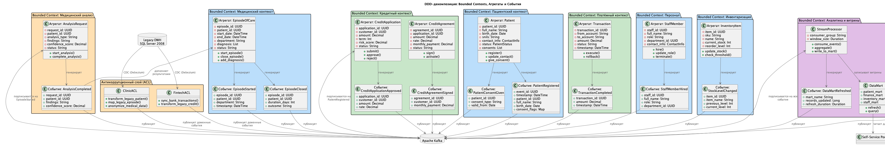
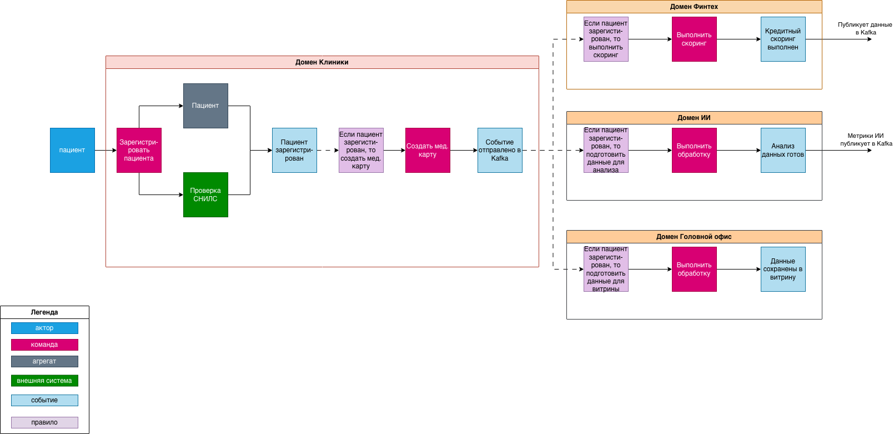

# Задание 4. Моделирование домена и интеграций

## 1. Разделите систему на домены с использованием подхода Domain-Driven Design (DDD). Определите bounded contexts для каждого домена и опишите ключевые агрегаты и события, которые будут играть важную роль при взаимодействии между доменами.

[Описание агрегатов](aggregates.md)

## 2. Опишите целевую событийную архитектуру, построив Event Storming-диаграмму или аналогичную схему. На диаграмме отразите основные события, публикуемые доменами. Например: «Создан кредитный договор», «Зарегистрирован новый пациент» или «Пройдено исследование ИИ». Укажите, какие домены выступают источниками этих событий, а какие — подписчиками.

[events.md](events.md)

### На примере "Зарегистрирован новый пациент"

## 3. [обоснование событийного подхода vs Camel/DWH](justification.md)